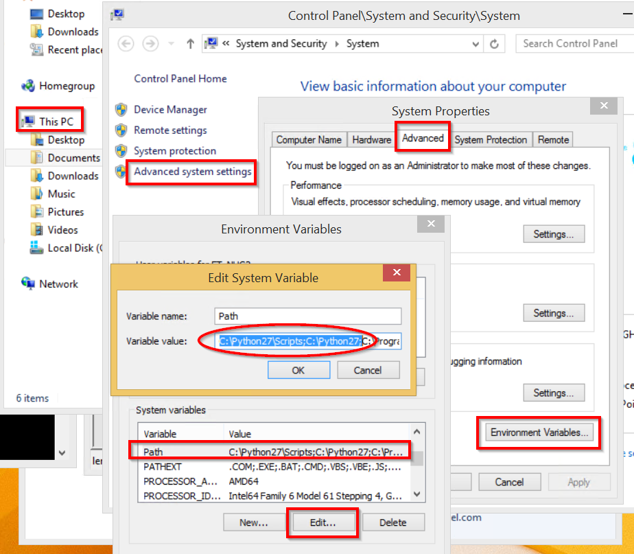
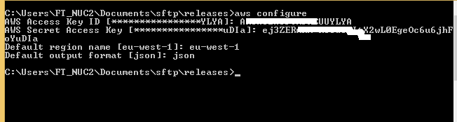
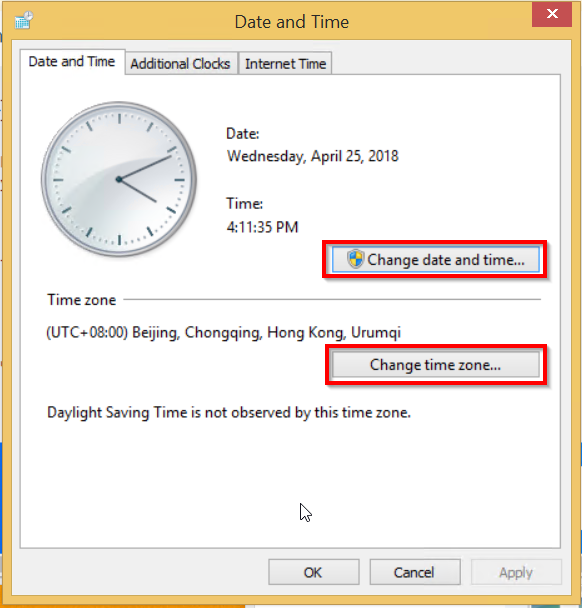

Getting Started
===============

This document will show you how to install and use ifits-sftp.

* Copy \\bjswft001.ccr.corp.intel.com\tools\sftp to the ~\Documents\ on test machine
* Connect the test machine to the internet
* install python2.7.14 from ~\Documents\sftp\tools\python-2.7.14.amd64.msi, and follow below snapshot to configure python environment variables

*  install Sphinx

    pip install sphinx sphinx-autobuild

*  install idata-security

    pip install -U idata-security-1.0.2.tar.gz

*  install idata-utils

    pip install -U ifits-utils-1.0.2.tar.gz

*  install idata-aws

    pip install -U ifits-aws-1.0.17.tar.gz

*  install idata-sftp

    pip install -U ifits-sftp-1.0.1.tar.gz

* configure aws env as below, run command 'aws configure' as normal user, input the aws access and security key, region and json

* check time zone and date time is latest

*  run sftp testing

     python -m ifits_sftp.speed_measurement
